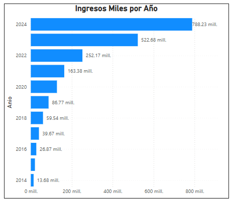
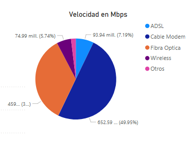
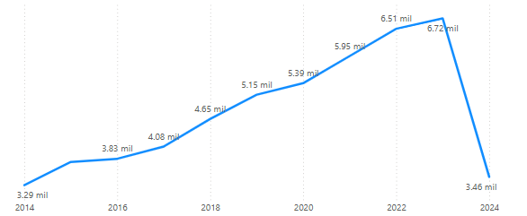
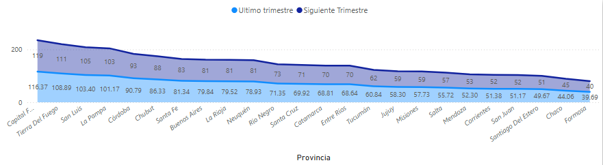
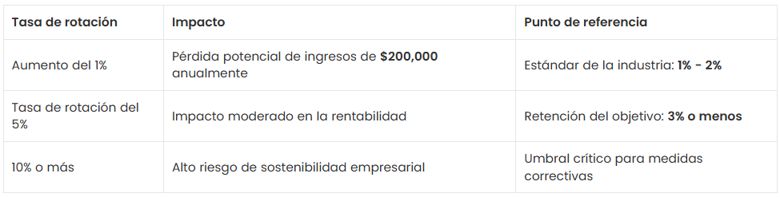
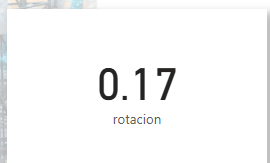

# Analisis de las Telecomunicaciones en el internet
{ height="300px" width="1300px"}

### Contexto
Las telecomunicaciones se refieren a la transmisión de información a través de medios electrónicos, como la telefonía, la televisión, la radio y, más recientemente, el internet. Estos medios de comunicación permiten la transmisión de información entre personas, organizaciones y dispositivos a largas distancias.

El internet, por su parte, es una red global de computadoras interconectadas que permite el intercambio de información en tiempo real. Desde su creación, ha tenido un impacto significativo en la vida de las personas, transformando la manera en que nos comunicamos, trabajamos, aprendemos y nos entretenemos.

La industria de las telecomunicaciones ha jugado un papel vital en nuestra sociedad, facilitando la información a escala internacional y permitiendo la comunicación continua incluso en medio de una pandemia mundial. La transferencia de datos y comunicación se realiza en su mayoría a través de internet, líneas telefónicas fijas, telefonía móvil, y en casi cualquier lugar del mundo.

En comparación con la media mundial, Argentina está a la vanguardia en el desarrollo de las telecomunicaciones, teniendo para el 2020 un total de 62,12 millones de conexiones.

### Fuente de Datos

[Datos Abiertos](https://indicadores.enacom.gob.ar/datos-abiertos)

[Diccionario de datos](https://docs.google.com/document/d/1BYW0vT_DNIjjKM9v4hNg5KmqjRNOc7OBB1jCXc80gnI/edit?tab=t.0#heading=h.hjukififf3ol)

### Analisis
Se analizaron los ingresos, velocidades, penetracion, técnologia a lo largo de 10 años (2014 al 2024)

#### Insights

- Tanto los ingresos como la velocidad van aumentando conforme van aumentando los años

- ADSL va disminuyendo en la actualidad, cable modem esta muy bien posicionado y fibra optica esta siendo muy fuerte

- Aún hay hogares con dial up, pero esto ya es muy minimo. Que tan costoso es seguir manteniendo esta técnologia.
- Van subiendo los accesos a como va avanzando el año, asi que es importante siempre contar con lo requerido

- Disminuyo los accesos de rango a partir del 2023

### KPIs

#### Aumentar en un 2% 
Para obtener el KPI del acceso al servicio de internet para el próximo trimestre, cada 100 hogares, por provincia. La fórmula es la siguiente:
        

A continuación el KPI por provincia con un incremento de 2% al próximo bimestre

#### Tasa de rotación
El tasa de rotación es una métrica crítica para cualquier negocio de infraestructura de telecomunicaciones. Mide el porcentaje de suscriptores que suspenden su servicio durante un período de tiempo específico. Una tasa de rotación más baja indica una mayor retención de clientes, que es esencial para mantener la rentabilidad en un mercado competitivo.

Para calcular la tasa de rotación, la fórmula es: 
Tasa de rotación (%) = (número de clientes perdidos durante el período / número total de clientes al comienzo del período) x 100

El seguimiento de este KPI es vital porque afecta directamente los ingresos y el valor de por vida del cliente. Por ejemplo, si la tasa de rotación aumenta solo 1%, puede reducir drásticamente el pronóstico de ingresos, afectando la eficiencia operativa y los KPI financieros para las telecomunicaciones.

 

Para nuestra telefonia el KPI es de:

Reducir la tasa de rotación no solo mejora la retenión de los clientes, sino que también mejora la general Satisfacción del cliente en Telecom. Esto se puede lograr a través de generar nuevas estrategias

## Datos técnicos

### Software:
    Sistema operativo 
        64 bits, procesador x64
        RAM 32.0 GB (31.9 GB utilizable)
        Edicion: Windows 11 Home

    Base de datos: 
        MySQL Workbench 8.0 CE

    Lenguaje:
        Python version 3.11.9

    Code Editor:
        Visual Studio Code:  1.90.2

    Aplicacion de visualización de datos:
        Power BI Desktop: 2.140.1351.0 64-bit (febrero de 2025)
    
    Repositorio:
        https://github.com/deliamontoya/Telefonia

### Estructura de Archivos:
    resources: 
        Folder que contiene los archivos de recursos en formato csv

    images:
        Folder contiene las imagenes utilizadas

    scripts.sql 
        Contiene la inserción en base de datos de cada uno de los recursos

    EDA (Exploratory Data Analysis) EDA.ipynb 
        Contiene el analisis de los datos

    Normalizacion.sql 
        Se aplicaron criterios que se encontraron en informe.ipynb
        
    Informe.ipynb  
        Contiene la presentación y KPIs 
            

#### Datos de contacto:
    Delia Montoya
    delia.montoy867@gmail.com